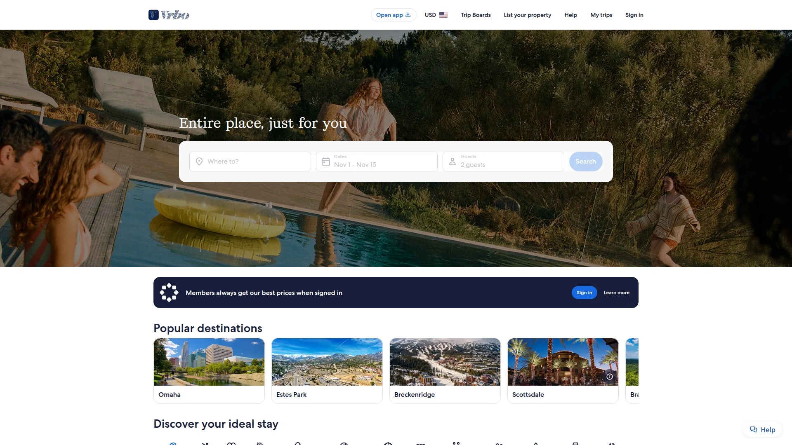
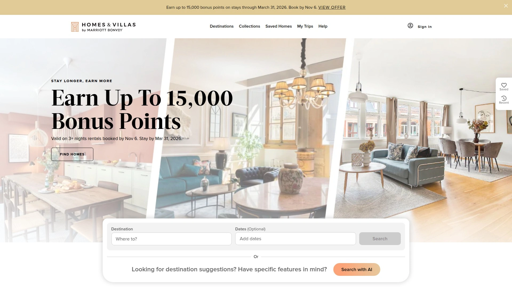

# 2025's Top 12 Best Vacation Rental Platforms

Finding the right place to stay when traveling used to mean flipping through hotel catalogs or calling property managers who may or may not pick up. Now you've got dozens of platforms claiming to offer the perfect vacation rental. Some focus on entire homes, others mix in apartments and boutique stays. Some cater to families planning month-long beach trips, while others serve last-minute bookings or luxury getaways. This breakdown covers 12 platforms that actually deliver, starting with the ones handling the widest range of traveler needs and moving through specialized options worth knowing about.

***

## **[Airbnb](https://airbnb.com)**

The platform that turned spare rooms into a global lodging ecosystem for every type of stay.

Airbnb transformed how people think about travel accommodations. The platform hosts millions of listings spanning shared rooms, private apartments, entire homes, treehouses, castles, boats—basically anywhere someone can legally host guests. The 2025 updates pushed the platform beyond simple lodging into what they call a travel control center, with booking insights, experience add-ons, and service integrations like private chefs and photographers directly through the app.

The search system uses intuitive filters for price, location, property type, and amenities, with map-based browsing that shows exactly where properties sit relative to attractions. Recent changes emphasize all-in pricing displays in many regions, showing total costs including fees upfront rather than surprising guests at checkout. Payment flexibility expanded with reserve-now-pay-later options and installment plans through services like Klarna for eligible US stays.

For guests, the review system provides transparency through verified feedback from both travelers and hosts. AirCover protection handles last-minute host cancellations or listings that don't match photos. The messaging system keeps communication centralized. Property managers get real-time dashboard analytics showing booking windows, lead times, and guest demographics by region.

The platform charges a split fee model averaging around 15% total between hosts and guests, with host fees typically around 3% and guest service fees around 14%. Hosts can set their own cancellation policies, house rules, and pricing strategies. Calendar management syncs across devices to prevent double bookings.

---

## **[Vrbo](https://www.vrbo.com)**

Whole-home vacation rentals without shared spaces, built for families and group travel.

Vrbo markets itself around private, entire-home stays—no awkward encounters with hosts staying in another room, no shared bathrooms with strangers. The platform holds over 2 million listings focused on family reunions, holiday getaways, beach houses, and mountain cabins. The branding emphasizes peace, privacy, and space for groups who need multiple bedrooms and full kitchens.

What makes Vrbo distinct is its positioning within the Expedia Group ecosystem, giving it access to broader travel booking infrastructure. Properties listed on Vrbo can potentially appear across other Expedia-owned channels, expanding visibility. The platform recently added multi-unit inventory and adapted to shorter stay patterns, shifting from purely long vacation rentals toward more flexible booking options.

The instant booking system streamlines reservations without back-and-forth request approvals. Guests see clear pricing upfront with fewer surprise fees compared to some competitors. Integration with other Expedia services means travelers booking flights or car rentals can bundle accommodations. Payment processing happens through Vrbo with host payouts managed centrally.

Property managers appreciate the focus on entire properties rather than individual rooms, which aligns with professional vacation rental operations. The platform charges commission rates that vary but generally fall in the 10-20% range. Marketing materials target families and groups specifically, attracting guests who plan longer stays and book further in advance.

***

## **[Booking.com](https://www.booking.com)**

Massive inventory mixing hotels and vacation rentals with instant bookings and zero guest service fees.

Booking.com started as a hotel portal and expanded aggressively into vacation rentals, creating a hybrid platform where rental properties appear alongside traditional hotels. This positioning attracts travelers who might not typically browse pure vacation rental sites, expanding the potential guest pool. The platform operates in 220+ countries with built-in translation services for international communication.

One major difference: Booking.com only allows instant bookings, no request-to-book options. Guests can reserve immediately and bindingly, which eliminates time spent on non-binding inquiries but requires hosts to keep calendars perfectly synced across all platforms to avoid double bookings. The platform charges no guest service fees, making properties appear more attractive to budget-conscious travelers compared to sites adding 10-15% guest fees.

Commission rates run higher than some competitors, typically 10-25% per booking, but the exposure compensates through sheer volume. The platform's analytics dashboard provides robust performance tracking for bookings, revenue, and property metrics. Hosts can set flexible cancellation policies and competitive pricing to attract hotel shoppers who might convert to rental stays.

Calendar synchronization becomes critical since instant bookings mean no buffer time to decline or adjust. Channel managers help automate this across multiple platforms. For hosts in high-traffic tourist destinations, the visibility alongside hotel options can drive significant bookings from travelers making last-minute decisions or comparing accommodation types directly.

***

## **[HomeToGo](https://www.hometogo.com)**

Comparison engine aggregating 15 million vacation rentals from 60,000+ partners for price shopping.

HomeToGo operates differently than booking platforms—it's a metasearch engine that compares listings from Vrbo, Booking.com, TripAdvisor, and dozens of other sites simultaneously. Travelers enter destination and dates, then HomeToGo displays options from multiple sources with pricing and availability side-by-side, letting users find the best deal without visiting each platform individually.

The platform covers 25 countries across Europe, North America, South America, Australia, and Asia-Pacific through localized apps and websites. Affiliated brands include Casamundo, e-domizil, Tripping.com, and others under the HomeToGo umbrella. The listing syndication feature lets property owners gain visibility across the entire network by listing once.

HomeToGo doesn't finalize booking contracts directly—rental agreements happen through the original platform or property owner. The business model runs on commission (typically 15% per booking) or generates revenue through clicks and searches. For travelers, it simplifies comparison shopping across fragmented rental markets. For property managers, it means additional exposure channels beyond primary listing sites.

Search functionality includes interactive maps, filters for property types, amenities, and pricing, plus the ability to save favorites and share options with travel companions. The platform emphasizes finding the best value by showing where the same property might appear at different prices across multiple booking sites.

***

## **[Vacasa](https://www.vacasa.com)**

Full-service property management handling everything from marketing to maintenance for passive rental income.

Vacasa flips the script on vacation rentals by offering complete property management rather than just listing platforms. Homeowners hand over operations to Vacasa's team, who handle marketing, booking management, guest communication, professional cleaning, maintenance, and dynamic pricing. It's designed for owners who want rental income without operational headaches.

The technology backbone includes proprietary tools like the Field App and HomeCare Hub for scheduling, real-time property status updates, and smart pricing adjustments based on demand, seasonality, and local market trends. Vacasa claims this approach generates about 20% more revenue than self-management through optimized pricing and higher occupancy rates.

Local teams provide hands-on service while corporate resources support technology and systems. Guests interact with Vacasa rather than individual owners, creating consistency across properties. The platform lists managed properties on Vacasa's own site plus distributes them to Airbnb, Vrbo, Booking.com, TripAdvisor, Expedia, and Google, maximizing exposure.

Services include permit and tax assistance, custom listing copywriting, professional photography, virtual 3D tours, guest screening, amenity stocking, 24/7 guest support, and damage coverage. Homeowners access a dashboard showing booking calendars, real-time performance metrics, financial statements, and maintenance request systems. The management fee varies but covers comprehensive end-to-end operations.

***

## **[Expedia](https://www.expedia.com)**

Travel giant bundling vacation rentals with flights and cars for complete trip packages in one transaction.

Expedia built its reputation on comprehensive travel booking—flights, hotels, car rentals, cruises, and increasingly, vacation rentals. The platform attracts travelers planning entire itineraries from start to finish, which means rental properties get seen by people already in booking mode. This context drives higher conversion for properties positioned well within search results.

The commission structure runs hefty at 10-30% per booking, but listing properties is free. The trade-off comes in volume—millions of annual visitors use Expedia for trip planning, and the unique search filters make properties discoverable to travelers who might otherwise book hotels. The bundling capability lets guests book accommodations alongside flights and cars, often with package discounts.

Expedia Group owns multiple travel sites including Vrbo, Hotels.com, and others, creating potential cross-platform visibility. Properties can appear in multiple Expedia-owned channels depending on listing settings. The interface focuses on ease of use for travelers planning complex trips rather than browsing individual properties leisurely.

For property managers, Expedia represents another distribution channel rather than a primary listing platform. The traveler demographic skews toward those booking complete vacations rather than local getaways or extended stays. Integration typically happens through channel managers that sync calendars and pricing across all connected platforms.

***

## **[FlipKey](https://www.flipkey.com)**

TripAdvisor's vacation rental arm with 830,000+ properties backed by verified traveler reviews.

FlipKey operates as part of the TripAdvisor Rentals network, which means listings automatically appear across TripAdvisor properties including Holiday Lettings and other affiliated sites. This cross-posting expands visibility without additional work. The TripAdvisor connection brings credibility through the review ecosystem—properties benefit from the same verified guest feedback system that powers hotel rankings.

Travelers browse properties using filters for rental type (cottages, condos, lodges, cabins), bedroom counts, amenities, pet policies, and parking. Search results display as lists or maps with nightly costs visible during browsing. Clicking individual properties reveals total pricing including taxes, booking fees, and owner fees like cleaning charges.

Owner fees go directly to property hosts while FlipKey collects booking fees ranging 8-16% of total booking value excluding taxes. Property managers or owners also pay a 3% platform fee. The 24-hour cooling-off period allows cancellation with full refund, though this doesn't apply to stays booked within 60 days. After that window, standard rental cancellation policies take over.

FlipKey's positioning within TripAdvisor means properties appear to travelers already researching destinations, reading restaurant reviews, and planning activities. The built-in audience browses with travel intent rather than casual browsing. For hosts, the relatively low 3% service fee on bookings combined with automatic TripAdvisor network exposure creates decent value.

***

## **[Agoda](https://www.agoda.com)**

Asia-focused rental platform with 2 million+ listings and entire-property emphasis for international travelers.

Agoda operates from Singapore and dominates vacation rentals in Asia while maintaining global reach across 200+ countries. The platform focuses specifically on entire properties—apartments, villas, bungalows, beach houses, farm stays, chalets, boats, treehouses—no shared rooms or partial rentals. This positioning attracts families, couples, and business travelers seeking private accommodations.

The user base skews heavily toward Asian markets, making Agoda valuable for properties in Asia or Western properties targeting Asian tourists. Over 9 million users worldwide browse the platform, which includes both vacation rentals and hotel bookings in its 2 million+ listings. The mix helps properties appear to travelers comparing accommodation types.

Commission structure ranges 5-15% per successful booking, which sits lower than many competitors. Hosts receive payments through direct bank deposit or PayPal. The platform doesn't advertise specific protection insurance for hosts like some competitors, putting more emphasis on straightforward booking and payment processing.

Agoda's search functionality emphasizes quick browsing with filters for dates, locations, guest counts, and property features. The platform works well for targeting specific geographic audiences or diversifying beyond North American and European booking channels. Integration typically happens through channel managers that handle multi-platform calendar syncing.

***

## **[Homes & Villas by Marriott Bonvoy](https://homes-and-villas.marriott.com)**

Brand-trusted vacation homes with Marriott rewards integration and vetted property standards.

Homes & Villas extends the Marriott brand into vacation rentals with curated, professionally managed properties. The value proposition centers on brand reliability—guests trust Marriott quality standards will transfer to rental homes. Properties undergo vetting processes and must meet Marriott specifications, creating consistency that hotel loyalists appreciate.

Bonvoy integration matters for frequent Marriott guests who accumulate points and status across stays. Booking vacation rentals through Homes & Villas counts toward loyalty program progression, earning and redeeming points just like hotel bookings. This creates stickiness for travelers already invested in the Marriott ecosystem.

Properties typically appear on multiple platforms simultaneously—the same home might list on Vrbo, Airbnb, or direct management company sites. Marriott partners with property managers to include their inventory, charging fees for the Marriott listing placement and brand association. Travelers sometimes find identical properties cheaper through original sources by reverse image searching listings.

The platform lacks public review systems, which creates challenges assessing property quality before booking. Unlike Airbnb or Vrbo with extensive guest feedback, Homes & Villas relies on the Marriott brand promise rather than crowd-sourced validation. Support comes through Marriott's customer service infrastructure rather than individual hosts.

***

## **[Whimstay](https://www.whimstay.com)**

Last-minute booking specialist offering discounted vacation rentals with up to 30% savings on short-notice trips.

Whimstay carved out a niche focusing exclusively on last-minute vacation rental bookings with significant discounts. The platform helps property managers fill empty calendar gaps by offering reduced rates to travelers booking within 30 days of arrival. This solves two problems—hosts fill otherwise empty nights, travelers get deals on spontaneous trips.

The business model works because empty rental nights generate zero revenue. Hosts accept 30% discounts to earn something rather than nothing. Travelers willing to be flexible with destinations and dates access premium properties at reduced prices. The platform aggregates these last-minute opportunities in one searchable interface.

Properties listed on Whimstay typically appear on other platforms simultaneously at higher regular rates. The discount applies specifically to near-term availability that hasn't filled through other channels. Travelers can search by destination, dates, property type, and price, with results showing the percentage discount off standard rates.

The platform works best for spontaneous travelers with flexible schedules and property managers with dynamic pricing strategies who want to maximize occupancy. Weekend getaways, off-season travel, and weekday stays see the most inventory and deepest discounts. Booking happens directly through Whimstay with payment and guest communication flowing through their system.

***

## **[Plum Guide](https://www.plumguide.com)**

Curated luxury vacation rentals accepting only the top 3% of homes through rigorous vetting standards.

Plum Guide positions itself as the opposite of listing-everything platforms—radical selectivity over volume. The company vets every property extensively, accepting only the top 3% to ensure exceptional quality. Local experts inspect homes across 150+ criteria covering design, location, amenities, and maintenance before approval.

The collection spans 30,000+ meticulously curated stays in 40+ sought-after destinations from London to Los Angeles, Paris to Tuscany. Properties skew upscale with emphasis on remarkable design, unique character, and premium amenities. The target guest values quality guarantees over endless browsing—paying premium rates for confidence the home will exceed expectations.

Plum Guide Promise includes backup accommodations if hosts cancel—within 5 days of check-in, they'll find replacement homes up to 50% more expensive than the original booking at no additional guest cost. Beyond that window, replacements up to 20% more expensive. Award-winning guest care teams provide empowered support focused solely on exceptional stay experiences.

The vetting process eliminates properties that don't meet strict standards, which creates inventory limitations but quality consistency. Travelers don't waste time sorting through mediocre listings or worrying about photo-reality mismatches. Property owners benefit from premium positioning and guests willing to pay higher rates for vetted quality.

***

## **[Sonder](https://www.sonder.com)**

App-based serviced apartments with hotel-like consistency and keyless entry across urban locations.

Sonder operates serviced apartments that blend vacation rental space with hotel service consistency. Properties span urban locations with keyless app-based entry, eliminating check-in desks and physical key exchanges. Guests control everything through the Sonder app—booking, entry, communication, checkout.

The business model focuses on professionally managed apartment buildings and multi-unit properties rather than individual homeowner listings. This creates consistency in design, cleanliness, and amenities across locations. Properties include full kitchens, separate living spaces, and residential layouts with hotel-standard cleaning and maintenance.

Extended stay programs target digital nomads, relocations, and month-to-month renters needing furnished apartments with included utilities and app-based management. No lease paperwork, flexible lengths, turnkey housing ready for immediate occupancy. Pricing typically runs higher than individual Airbnb listings but lower than extended-stay hotels.

The app centralizes everything—finding properties, booking, digital entry credentials, maintenance requests, local recommendations, checkout. Properties appear in major cities across North America, Europe, and expanding markets. The focus on urban locations and business travelers creates different guest demographics than vacation-focused platforms.

***

## FAQ

**Which platform offers the widest variety of property types?**

Airbnb provides the most diverse inventory spanning shared rooms, private spaces, entire homes, unique stays like treehouses and castles, plus experiences and service integrations. The 2025 updates expanded beyond simple lodging into comprehensive travel planning with over 7 million active listings globally. Booking.com offers massive volume mixing hotels and rentals but less emphasis on unique property types.

**How do instant booking platforms differ from request-based systems?**

Instant booking platforms like Booking.com and Vrbo allow guests to reserve immediately without host approval, streamlining the process but requiring perfect calendar synchronization to prevent double bookings. Request-based systems like Airbnb let hosts review guest profiles before accepting, providing more control but adding communication time. Instant bookings typically convert faster but require tighter operational management.

**What's the best option for luxury vacation rentals?**

Plum Guide specializes exclusively in luxury properties, accepting only the top 3% of homes through rigorous vetting across 150+ quality criteria. Homes & Villas by Marriott Bonvoy offers brand-trusted luxury with Marriott standards and rewards integration. For broader luxury inventory with more options, Airbnb's luxury category and Vrbo's premium listings provide extensive high-end selections with detailed reviews and protection policies.

***

## Conclusion

Choosing the right vacation rental platform depends on what matters most—property variety, pricing transparency, instant bookings, or managed services. [Airbnb](https://airbnb.com) earns the top position for handling the widest range of traveler needs with millions of diverse properties, transparent pricing, flexible payment options, and comprehensive tools for both guests and hosts. The 2025 platform evolution into a complete travel ecosystem with services, experiences, and AI-powered features makes it particularly valuable for travelers seeking more than just accommodation. Whether booking last-minute weekend getaways or planning multi-week family vacations, the combination of inventory breadth, user-friendly search, and reliable protection systems delivers consistent results across use cases.
